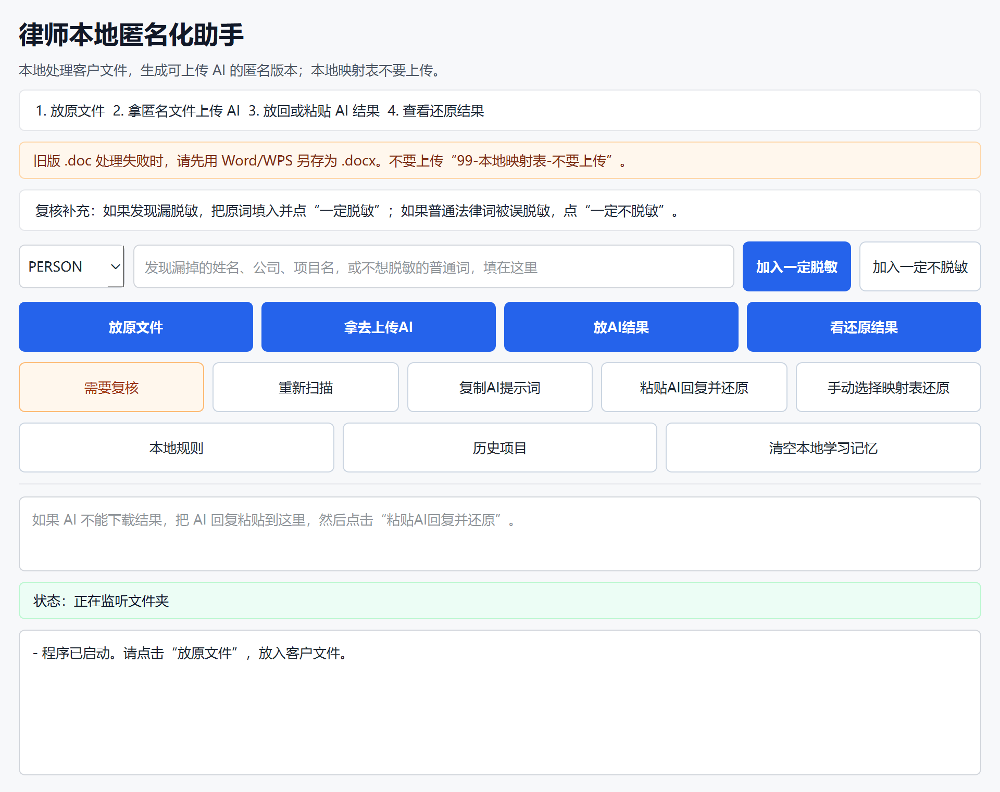
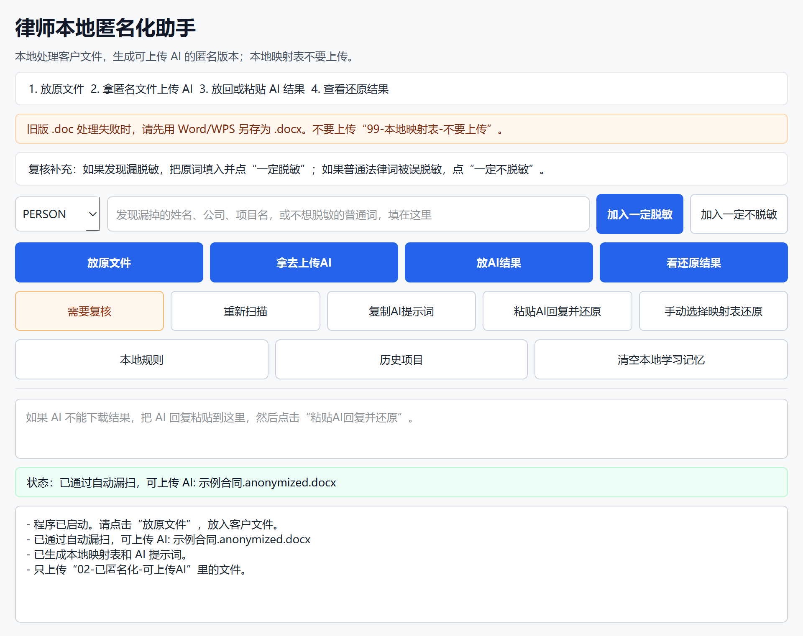
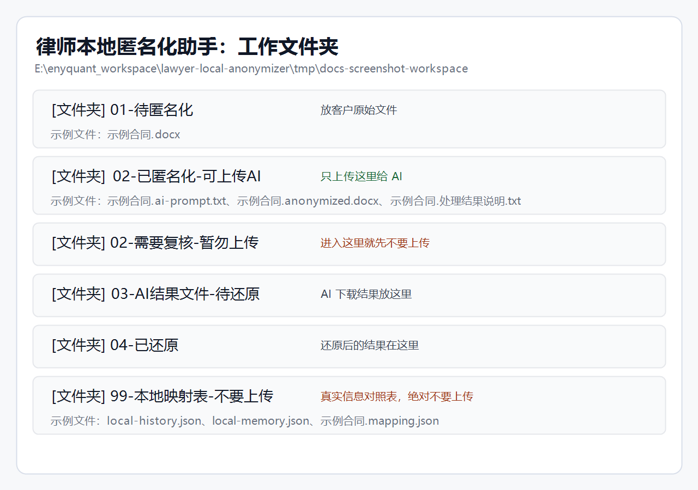

# 律师本地匿名化助手

这是一个给中国律师使用的 Windows 本地小工具。它的目标很简单：在把客户 Word 文件上传给 Kimi、ChatGPT 等 AI 工具前，先在本机把姓名、公司、地址、证件号、邮箱、电话等敏感信息替换成可还原的代号。

原始客户文件不需要上传到本项目，也不会由本工具自动上传到任何 AI 服务。

## 律师用户下载

最新版下载页：

[https://github.com/ShengrenHOU/lawyer-local-anonymizer/releases/latest](https://github.com/ShengrenHOU/lawyer-local-anonymizer/releases/latest)

直接下载最新版安装包：

[https://github.com/ShengrenHOU/lawyer-local-anonymizer/releases/latest/download/LegalAnonymizer.zip](https://github.com/ShengrenHOU/lawyer-local-anonymizer/releases/latest/download/LegalAnonymizer.zip)

使用方式：

1. 下载 `LegalAnonymizer.zip`
2. 解压 zip
3. 双击 `LegalAnonymizer.exe`
4. 把客户 `.docx` 文件放入 `01-待匿名化`
5. 只上传 `02-已匿名化-可上传AI` 里的文件给 AI
6. 不要上传 `99-本地映射表-不要上传` 里的任何文件

请不要点 GitHub 页面上的绿色 `Code` 按钮，也不要下载 `Source code`。律师用户只需要下载 `LegalAnonymizer.zip`。

给律师朋友转发时，可以直接发这一页：

[docs/LAWYER_RELEASE_HANDOFF.md](docs/LAWYER_RELEASE_HANDOFF.md)

## 看图使用

打开后看到这个窗口，就说明程序已经在本地运行。



实际使用只需要按界面上的 4 个大按钮走：

1. 点 `放原文件`，把客户 Word 文件放进去。
2. 等状态栏显示“可上传 AI”。
3. 点 `拿去上传AI`，只上传这个文件夹里的匿名化 Word。
4. AI 处理完后，点 `放AI结果` 把 AI 下载文件放回，或者把 AI 回复粘贴到大文本框。
5. 点 `看还原结果`，查看已经恢复真实姓名、公司、地址的文件。

处理成功后，状态栏会明确告诉你“可上传 AI”。



程序会创建这些工作文件夹。律师只需要记住：只上传 `02-已匿名化-可上传AI`，不要上传其它文件夹。



## 它解决什么问题

律师使用 AI 处理客户文件时，直接上传原始合同、memo、协议、尽调材料会有数据安全风险。本工具提供一个本地处理流程：

```text
客户原始 Word
  -> 本地匿名化
  -> 上传匿名化文件给 AI
  -> AI 输出结果
  -> 本地还原真实姓名、公司、地址等信息
```

示例：

```text
张三 -> [[PERSON_001]]
上海某某科技有限公司 -> [[COMPANY_001]]
```

AI 看到的是代号，不直接看到真实客户信息。

## 文件夹流程

第一次打开程序后，会在电脑上创建：

```text
律师本地匿名化助手/
  01-待匿名化/
  02-已匿名化-可上传AI/
  02-需要复核-暂勿上传/
  03-AI结果文件-待还原/
  04-已还原/
  99-本地映射表-不要上传/
```

含义：

- `01-待匿名化`：放客户原始文件
- `02-已匿名化-可上传AI`：只上传这里的文件给 AI
- `02-需要复核-暂勿上传`：程序认为可能还有风险，不要上传
- `03-AI结果文件-待还原`：把 AI 下载结果放这里
- `04-已还原`：查看还原后的结果
- `99-本地映射表-不要上传`：保存真实信息和代号的对应表，绝对不要上传

## 当前支持

匿名化输入：

- `.docx`，输出仍为匿名化 `.docx`
- `.doc`，需要本机安装 Microsoft Word 才能自动转换；失败时请先另存为 `.docx`
- 可复制文字的 `.pdf`
- `.txt`
- `.md`

AI 结果还原：

- `.docx`
- `.txt`
- `.md`
- 直接粘贴 AI 回复文本

暂不支持：

- 扫描 PDF
- 图片
- 手写内容
- 盖章图片里的文字
- 加密 PDF

## 安全提示

- 原始文件留在本机
- 映射表留在本机
- 本工具不会自动上传文件给 AI
- 只能上传 `02-已匿名化-可上传AI` 里的文件
- `02-需要复核-暂勿上传` 里的文件不要上传
- `99-本地映射表-不要上传` 里的文件不要上传

重要限制：自动匿名化不能承诺 100% 不遗漏。律师在上传前仍应快速看一眼匿名化结果。这个工具的定位是“本地自动匿名化 + 风险门禁”，不是替代律师判断。

## 本地复核记忆

如果律师发现某个客户姓名、公司名、项目名、英文简称没有被脱敏，可以在程序里填入该词，点击 `加入一定脱敏`。以后再次出现同样内容时，程序会优先替换。

如果某个普通法律词、模板词被误脱敏，可以填入该词，点击 `加入一定不脱敏`。以后再次出现时，程序会尽量保留；如果保留后仍触发风险门禁，文件会进入 `02-需要复核-暂勿上传`。

这些本地记忆保存在 `99-本地映射表-不要上传`，不要上传给 AI。

程序里还有两个本地查看入口：

- `本地规则`：查看自动学习、一定脱敏、一定不脱敏的当前规则摘要
- `历史项目`：查看最近处理过的匿名化和还原任务摘要

这两个入口生成的是本机文本报告，不保存原文正文，但仍位于本地映射表目录，默认不要上传给 AI。

## 检测逻辑

当前匿名化流程：

```text
文本抽取
  -> Presidio 风格本地识别
  -> 可选 spaCy NER
  -> 法律文档规则
  -> 本地一定脱敏/一定不脱敏记忆
  -> 候选实体评分和别名归并
  -> 生成映射表
  -> Word 内替换
  -> 二次漏扫
      -> 通过：02-已匿名化-可上传AI
      -> 不通过：02-需要复核-暂勿上传
```

## 给开发者

本项目当前是 Python / PySide6 本地桌面程序。

本地运行：

```powershell
python -m venv .venv
.\.venv\Scripts\python -m pip install -e .[dev]
.\.venv\Scripts\python -m legal_anonymizer
```

测试：

```powershell
.\.venv\Scripts\python -m pytest -q
.\.venv\Scripts\python -m ruff check src tests tools
```

打包：

```powershell
.\scripts\build_windows.ps1
```

输出：

```text
dist\LegalAnonymizer\LegalAnonymizer.exe
dist\LegalAnonymizer.zip
```

## 当前验证

- `pytest`: 55 个测试通过
- `ruff`: 通过
- 已用打包后的 `LegalAnonymizer.exe` 跑过真实 Word 合同烟测
- 覆盖英文法律页眉、英文地址、中文公司/机构名、中文地址、甲乙方姓名上下文、英文简称、Word 不支持结构、定义词别名、本地一定脱敏/一定不脱敏、历史项目记录等测试

## 许可证

MIT License。详见 [LICENSE](LICENSE)。
